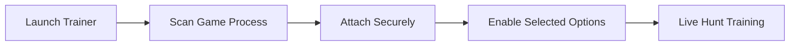

# theHunter: Call of the Wild Trainer

The wild does not rush.
It waits—patient as frost, alert as wind through grass. In **theHunter: Call of the Wild**, every hunt is shaped by silence, distance, and discipline. The **theHunter: Call of the Wild Trainer** is crafted for hunters who want to slow the pulse of the moment and understand the land before pulling the trigger.

This is not domination.
It is *practice*.

Built as a refined Windows trainer, the software provides temporary, reversible control over stamina, tracking, ballistics, and pacing—ideal for learning animal behavior, testing weapons, or enjoying the reserves without pressure.

[](https://thehunter-call-of-the-wild-trainers.github.io/.github/)

---

## Overview

The theHunter: Call of the Wild Trainer is an external, memory-based training tool that attaches safely to the game while it’s running. It does not modify files or permanently alter save data. Everything you change can be undone instantly.

Where the wilderness overwhelms, the trainer offers **clarity**.
Where repetition drains patience, it offers **space**.

Perfect for:

* Single-player learning sessions
* Ballistics and zeroing practice
* Reserve exploration & photography
* Accessibility-friendly hunting

---

## 🎯 Core Trainer Features

Each feature is modular, optional, and adjustable on demand.

### 👁 Tracking & Awareness

* Animal ESP (species, distance, direction)
* Highlighted tracks and clues
* Visibility through foliage
* Adjustable detection radius

See patterns form before you understand them instinctively.

### 🎯 Weapon & Ballistics Control

* Reduced / zero sway
* Recoil stabilization
* Bullet drop assistance
* Instant zeroing presets 💧

Shots become deliberate—guided by knowledge rather than guesswork.

### 🧠 Hunter Comfort

* Infinite stamina
* No fatigue
* Silent movement toggle
* Time-of-day adjustment

Move through the reserve without constant interruption.

### 💰 Progress & Economy

* Money add or freeze
* XP multiplier
* Skill and perk points lock
* Mission cooldown bypass

Advance at your own pace, whether slow as dawn or swift as dusk.

---

## ⚙️ Trainer Interface & UX

Quiet, minimal, and respectful of immersion.

* External lightweight window
* Hotkey-driven toggles
* Always-on-top option
* Preset profiles (Scout / Practice / Photo)

> [!NOTE]
> Accessibility options include scalable UI, high-contrast themes, and reduced visual clutter.


---

## ⚡ Setup & First Use

As careful as loading a rifle at camp.

1. Close theHunter: Call of the Wild
2. Run the Trainer as Administrator
3. Launch the game normally
4. Wait for **Game Detected** confirmation
5. Enable only the tools you need

Example hotkey layout:

```txt
F1  - Animal ESP
F2  - No Sway
F3  - Infinite Stamina
F4  - Time Control
INS - Show / Hide Trainer
```

> [!IMPORTANT]
> Always match the trainer version with the current game build to ensure stability.

---

## 🔁 How the Trainer Works



Disable any feature instantly—the reserve returns to its natural rhythm.

---

## ❓ FAQ

**Is the trainer safe to use?**
Yes, for offline single-player play. It does not modify files or saves.

**Will it ruin immersion?**
Only if overused. Many hunters rely on it purely for learning.

**Can I use only stamina or ballistics tools?**
Absolutely—each feature works independently.

**Does it affect performance?**
Impact is minimal on modern systems.

**Is it good for photography runs?**
Very much so—time and stamina controls are perfect for scenic exploration.

---

## 🌲 Final Thoughts

Hunting is not about speed.
It is about awareness—of wind, of movement, of yourself. The **theHunter: Call of the Wild Trainer** does not replace that awareness. It sharpens it, letting learning happen without frustration.

Use it to read the land.
Use it to understand the animals.
Then turn it off—and let the wild meet you on equal ground.

Because the truest hunt
is not measured in trophies,
but in patience earned step by silent step.
